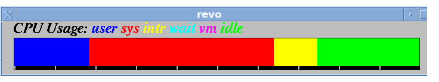

x11_osview
----------
**A clone of gr_osview**

x11_osview is a graphical CPU monitor program for the X Window System (X11). It is written in C using Xlib. It can been run locally or over a network connection.

I wrote x11_osview as a clone of SGI's gr_osview. My code is original. It requires a linux kernel version of 2.6.33 (Feb 2010) or greater on the client* machine. Data is gathered from `/proc/stat`.

x11_osview currently supports only the display of _overall_ CPU usage.

x11_osview has been tested on:

- Debian 10 & 12 _(client & X server)_
- Slackware 15 _(client & X server)_
- IRIX 5.3 _(X server)_

**To compile:**

`$ cc -o osview osview.c -lX11`

To run:

`$ ./osview &`

If running over a network, you will most likely use ssh. Remember to enable X forwarding with `ssh -X`.

You can also use the legacy port 6000 method along with `rsh` or `rlogin`. You must allow the remote system to access your local X server with `xhost +host`, where host is the hostname that the client program is running on. I have tested this works on IRIX 5.3.

**Bibliography:**

I used the following books to aid development of x11_osview:

- Xlib Programming Manual, 3rd Ed. _(Vol 1, O'Reilly, 1992)_
- Xlib Reference Manual, 3rd Ed. _(Vol 2, O'Reilly, 1992)_

**Bugs:**

On systems with few cores, the 'resolution' of the CPU bar is reduced. This is because of how the program measures CPU usage.

*'client' here means the system that the program actually runs on. The 'server' is the system that displays the X11 output (this confuses some). Both the client and server are commonly on the same computer.
